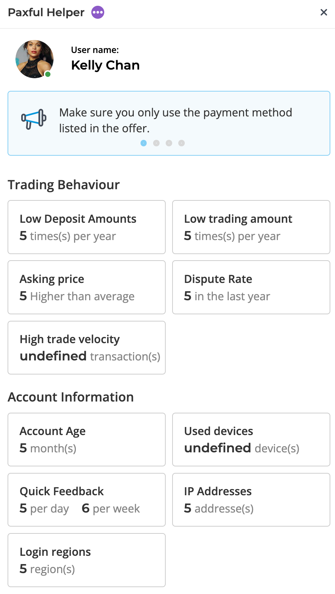

# Paxful V2

## Overview

Paxful Helper is a google chrome extension that retrieves and displays statistics / information about a specific user to you through a chrome pop-up. The chrome pop-up will only be able to be clicked on and viewed when you are on a user's profile page.

## Frontend

The frontend (pop up) was coded in pure HTMl, CSS and JavaScript.

After pressing the 'Learn More' button, the following page will be displayed.

## Backend

The backend was built using NodeJS with the express framework. The statistics for each box seen in the picture above should be retrieved by querying Paxful's private API endpoint.

However, the project was cut short and I never got to implement the querying side of the project. So I made it such that the backend endpoint would send a static data value, just to see that the frontend would correctly display the data.
